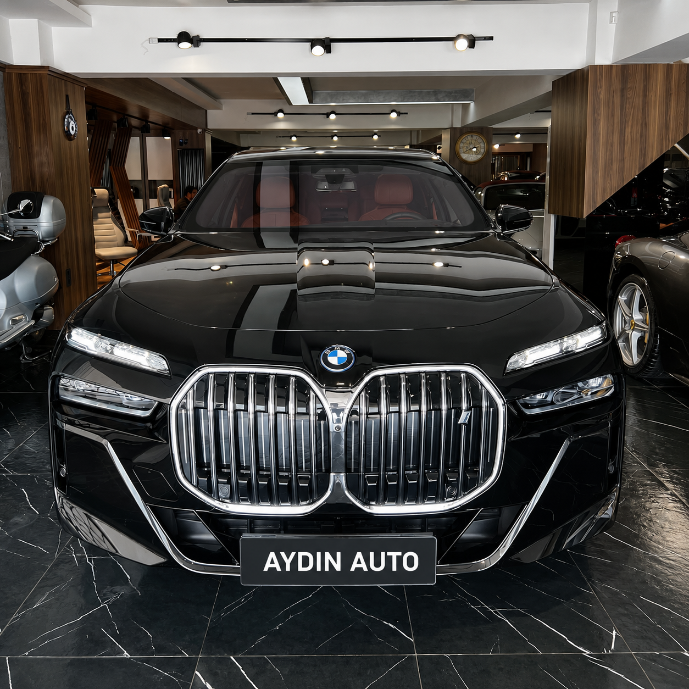
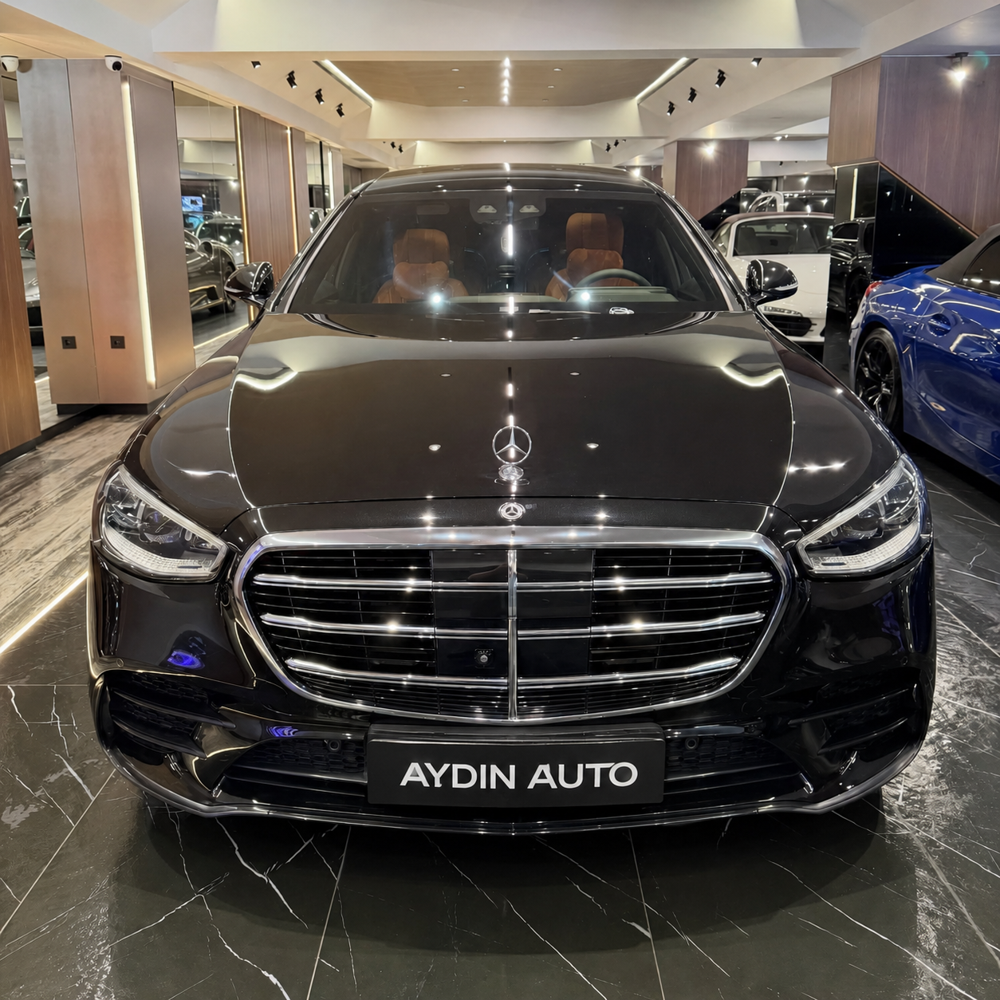
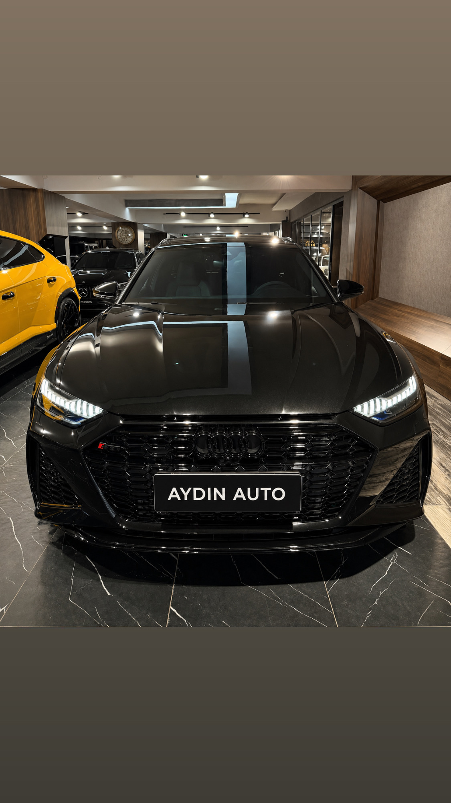
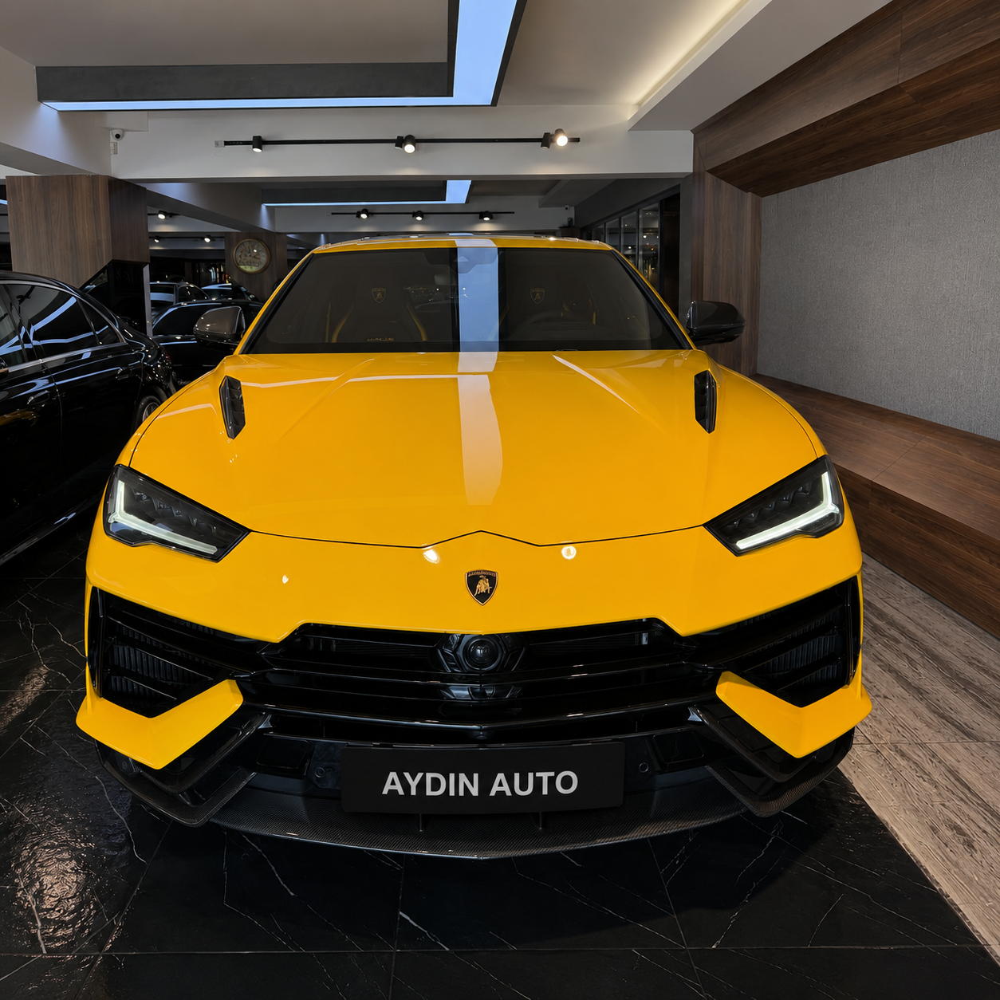
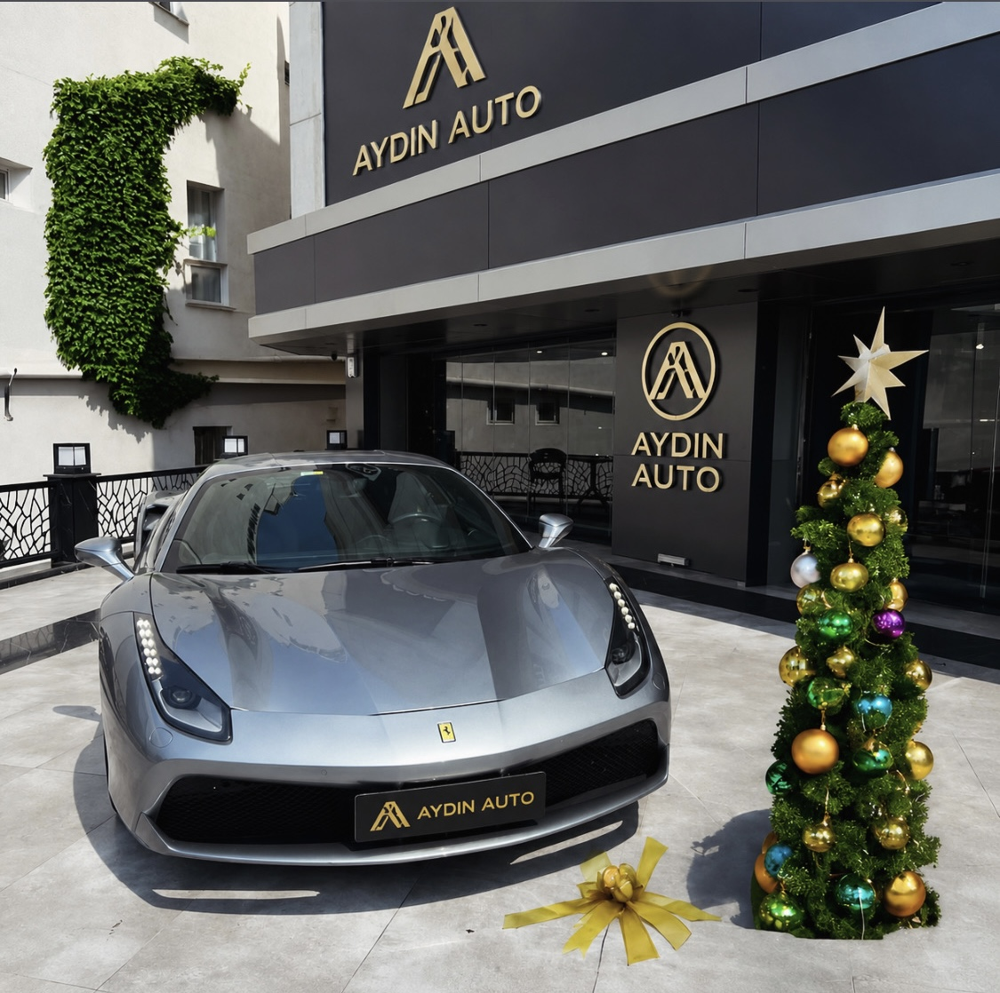
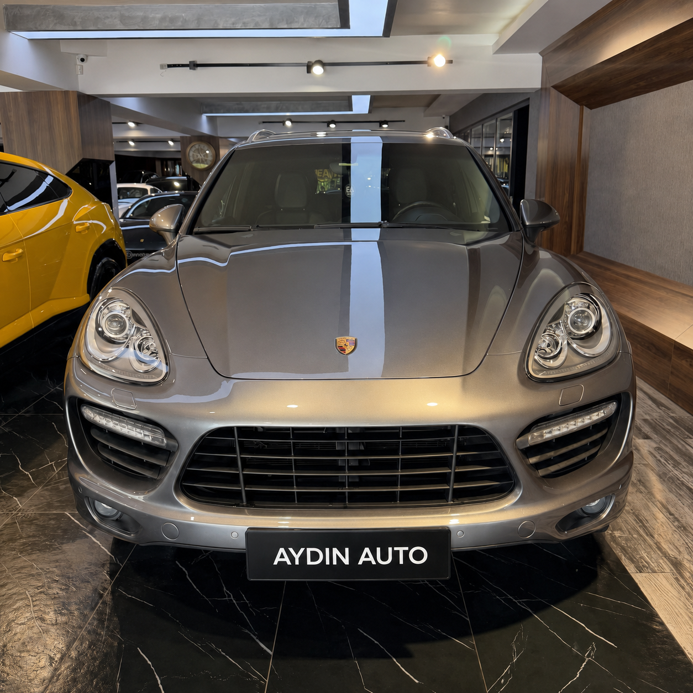

<html lang="tr">
<head>
<meta charset="UTF-8">
<meta name="viewport" content="width=device-width, initial-scale=1.0">

<title>AYDIN AUTO</title>

<link href="https://fonts.googleapis.com/css2?family=Poppins:wght@300;400;600;800&display=swap" rel="stylesheet">

</head>

<body>

<!-- MENÜ -->

AYDIN AUTO

☰

<a href="#">Ana Sayfa</a>
<a href="#cars">Araçlarımız</a>
<a href="#contact">İletişim</a>
<a href="https://instagram.com/aydinautoresmi" target="_blank">
Instagram
</a>

<!-- HERO -->

<section class="hero">

<h1>AYDIN AUTO</h1>

Premium otomobil deneyimi. 
Lüks, performans ve prestij bir arada.

</section>

<!-- ARAÇLAR -->

<h1 class="section-title" id="cars">
Araçlarımız
</h1>

<section class="cars">

<h2>BMW 7 Serisi</h2>

Luxury sedan deneyimi, üst düzey konfor ve premium detaylar.

<h2>Mercedes Maybach</h2>

Güçlü duruş, agresif lüks ruhu ve benzersiz sürüş hissi.

<h2>Audi Rs6</h2>

Saf performans, egzotik tasarım ve gerçek süper spor deneyimi.

<h2>Lamborghini Urus</h2>

Lüks SUV dünyasının en prestijli modellerinden biri.

<h2>Ferrari GTB</h2>

Süper spor ruhunu dünyasına taşıyan gerçek canavar.

<h2>Porsche Cayanne</h2>

Üst düzey Alman mühendisliği ve sportif SUV karakteri.

</section>

<!-- İLETİŞİM -->

<section class="contact" id="contact">

<h1>İLETİŞİM</h1>

📍 Esenyurt / Florya / Çorlu

📞 +90 212 519 70 12

📱 WhatsAp: +90 552 555 00 00

📧 info@aydinauto.com
 

📱 WhatsApp: +90 552 555 00 00

📧 info@aydinauto.com

<a href="https://instagram.com/aydinautoresmi" target="_blank">
Instagram Sayfamız
</a>

</section>

<!-- FOOTER -->

© 2026 AYDIN AUTO - Tüm Hakları Saklıdır

</body>
</html>