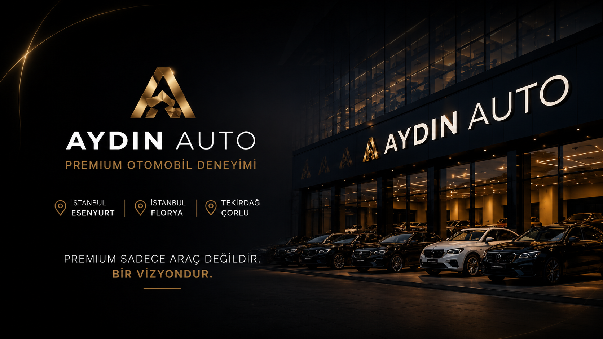

<!DOCTYPE html>
<html lang="tr">
<head>
<meta charset="UTF-8">
<meta name="viewport" content="width=device-width, initial-scale=1.0">
<title>AYDIN AUTO</title>

<link href="https://fonts.googleapis.com/css2?family=Poppins:wght@300;400;500;600;700;800&display=swap" rel="stylesheet">

</head>

<body>

<header>

<h1>AYDIN AUTO</h1>

Premium Otomobil Deneyimi

<a href="https://instagram.com/aydinautoresmi">
Instagram
</a>

</header>

<h2 class="section-title">Araçlarımız</h2>

<section class="cars">

<h2>Porsche Cayenne</h2>

Sportif SUV deneyimi ve premium sürüş konforu.

<h2>Mercedes Maybach</h2>

Ultra lüks sedan deneyimi ve prestijli tasarım.

<h2>Ferrari 488 GTB</h2>

Saf performans ve İtalyan mühendisliği.

<h2>Range Rover Vogue</h2>

Modern SUV dünyasının en premium modellerinden biri.

<h2>Lamborghini Urus</h2>

Süper spor ruhunu SUV dünyasına taşıyan canavar.

<h2>Audi RS6</h2>

Günlük kullanım ve yarış performansını birleştiren model.

</section>

<h2 class="section-title">Şubelerimiz</h2>

<section class="branches">

<h3>Esenyurt</h3>

Merkez Şube

<h3>Florya</h3>

2. Şube

<h3>Çorlu</h3>

3. Şube

</section>

<footer>

<h2>AYDIN AUTO</h2>

Sıfır & 2. El Premium Otomobiller

</footer>

</body>
</html>